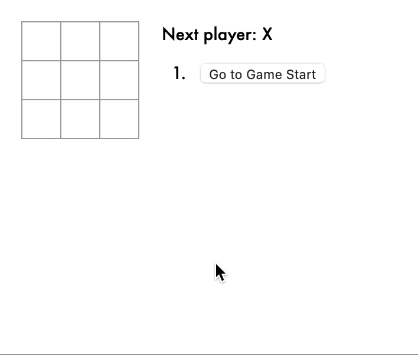
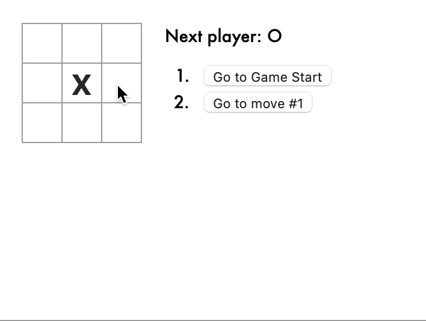

# Tic-Tac-Toe ❎🅾️❎

A simple Tic-Tac-Toe game coded in ReactJS.

- Displays the Winner at the end of the game. 
- Allows players to 'Time-travel' back to previous moves.

## Walkthrough GIF: 
### Basic Game 

### Time Travel 🪄

## How to Run: 

In the project directory, you can run the app with the following command:

### `npm start`

Runs the app in the development mode.\
Open [http://localhost:3000](http://localhost:3000) to view it in your browser.

